# Learning ML in Jax: Training an LSTM to Mimic My X Posts
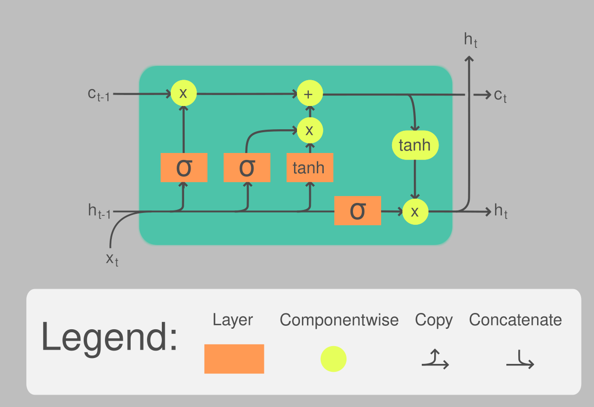</img>

In this post I go over how I trained an LSTM on my X posts. I also post resources/notes [and a colab where you can train](https://colab.research.google.com/drive/11VtLVqw8odPQRhAgx5CvdO_Rs-tA-2rZ?usp=sharing) on your own posts!

Here are some example outputs:

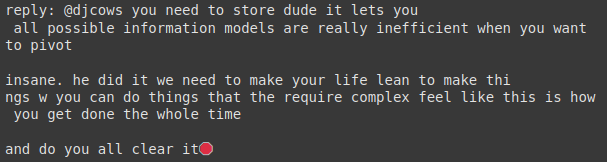 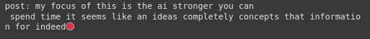

<i>these are roughly as coherent as my average post</i>

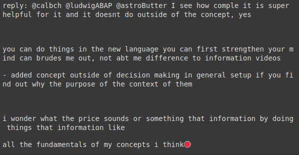 

My goal with this series is to get good at ML by practicing / doing projects in jax. My long term goal is to implement custom experiments.

I'm using jax to implement models essentially from scratch, excluding backprop, which is handled automatically by jax. 

Im also posting my progress in the <a href="https://x.com/i/communities/1860178670687818191">"LEARN BY BUILDING" community on X</a> where we build projects (ML, robotics, programming languages, etc) as an effective way to learn the topic.

</img>

'Learning ML in Jax' progress so far:
  - MLP training on MNIST
  - <a href="https://x.com/dnbt777/status/1861678239602913395">CNN trained on MNIST</a>
  - <strong>LSTM trained on my X posts</strong> <---- you are here

## Training an LSTM to Mimic My X Posts - Summary

I got an LSTM to train on my posts after repeatedly correcting my misunderstandings of how an LSTM works.

Below I go into detail and list all the resources I found helpful for implementing this.

Oh, and if you want to try it on your posts, or any .txt, I made a google colab [here](https://colab.research.google.com/drive/11VtLVqw8odPQRhAgx5CvdO_Rs-tA-2rZ?usp=sharing)

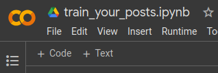</img>

## The plan (originally)
1. Get a simple char-level RNN to output shakespeare.

2. Overfit it on a single sample first to make sure I implemented a network that can learn.

3. Then train it on the full dataset

4. Then get the validation down

5. Finally, switch from shakespeare.txt to my_posts.txt and train it on my x posts

## What actually happened

a mess

### Attempting an RNN

I was able to get an RNN to output shakespeare decently

Though, it was probably moderately overfit as I hadnt even implemented validation yet

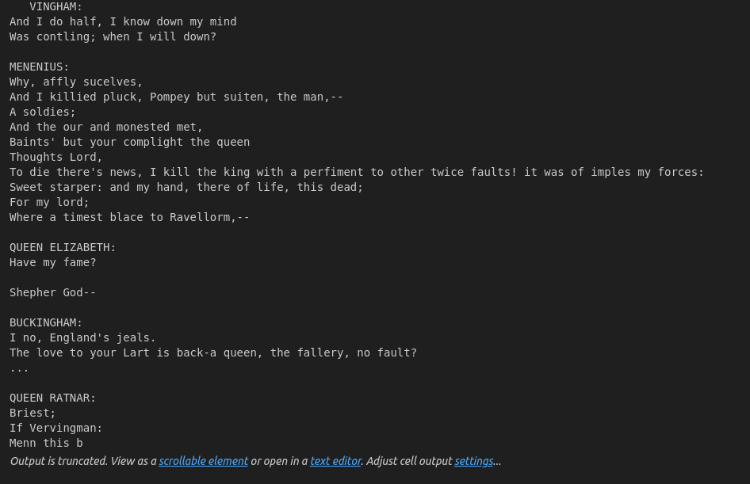</img>
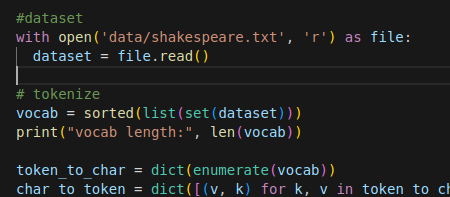</img>

I downloaded an archive of my x data, and had chatGPT generate a script to turn my tweets.js into a .txt file

The RNN was able to overfit on a single sample of my posts

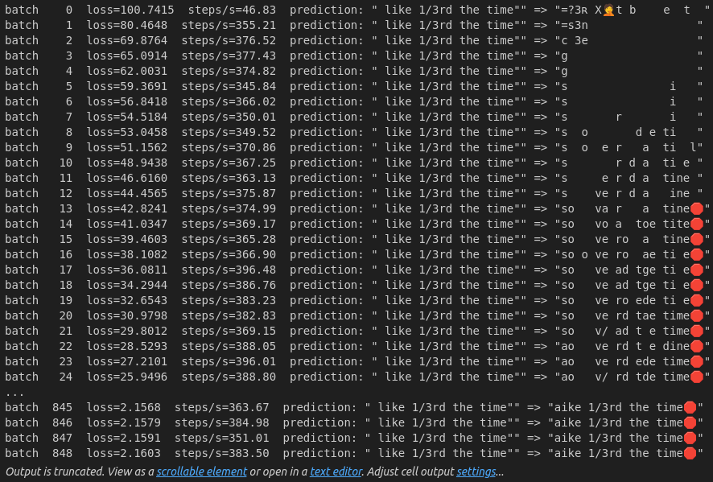</img>
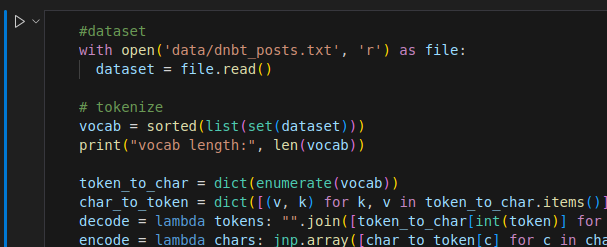</img>

But when it came to training on all of my posts, it couldn't learn words right for some reason. It learned to add spaces, but every word was gibberish.

I suspected that the model wasn't implemented right, or was 'blind' to some useful information because of a bug, and was just guessing

### Switching to an LSTM RNN

As I read more and more about <a href="http://karpathy.github.io/2015/05/21/rnn-effectiveness/">what karpathy did</a>, it turns out he implemented an LSTM, so I switched to that.

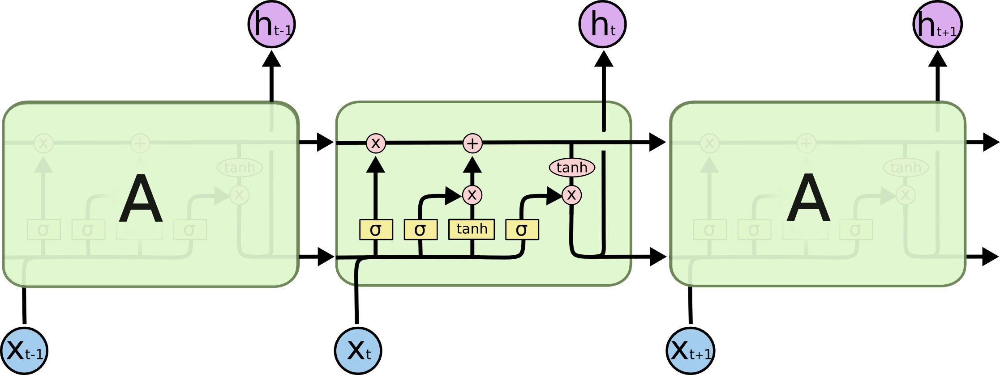</img>

<i>img credit https://colah.github.io/posts/2015-08-Understanding-LSTMs/ </i>

It sort of trained.. but still not well. As I later figured out, I implemented it incorrectly

### Fixing my understanding of LSTMs

So I poured over guides and lectures. It turns out, I had a flaw in my understanding of how RNNs/LSTMs processed sequences.

I thought the sequence length and lstm layer size was the same, and that you'd feed $x_t$ into $layer_t$.

In reality, you feed each $xt$ into each layer. I.e., if you only have one layer, you'd feed $x_t$ into it to get the next $h$ and $c$, and then feed that $h$, $c$, and $x_{t+1}$ back into it for the entire length of the sequence. Then, you'd take each $h$ generated at each $t$, and use this sequence of hs as the input sequence for the next layer.

So the resulting structure looks more like a grid than a line. This image is actually what made me realize I was implementing the model incorrectly.

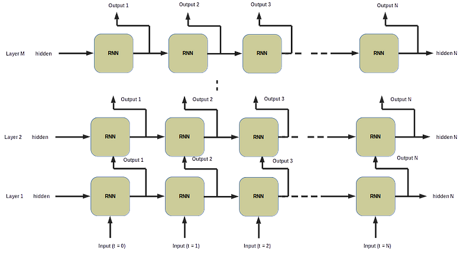</img>

<i>img credit https://www.analyticsvidhya.com/blog/2021/07/understanding-rnn-step-by-step-with-pytorch/ </i>

It trained better after I implemented the fix. Later, I realized that I also implemented the logic for the lstm block incorrectly.

My gates and operations were slightly wrong. This may have been because I initially implemented it when I was tired at night, and forgot that I had possibly implemented it wrong. However, <a href="https://d2l.ai/chapter_recurrent-modern/lstm.html">this AMAZING site</a> (which also has more on other ML models) showed me exactly what to do. It took me 5 minutes to make the change, and the model trained significantly better.

### Attempted optimizations: laddering and hyperparameter retuning

While playing around with training, I realized the model was extremely sensitive to hyperparameters. I also noticed that changing the hyperparameters mid-training could help.
I had the model on a learning rate decay schedule, but I wasn't sure what the right schedule was. So I implemented a 'ladder' of hyperparameter changes for the model to climb through. I wanted the model to initially overfit on small groups of characters, and then move up and generalize long sequences.
[image of laddering]

This didn't work well. Probably because I'm no good at manually picking hyperparameters, or maybe there was some bug in my code. Maybe the idea could work with some effort, so I may revisit it way off in the future if I have nothing better to do.

I implemented hyperparameter tuning during the training process. This worked OK. Essentially the model would generate a random sample of all possible combinations of hyperparameters, train on a few of them, and then use the best performing combination. The hparams would be re-tuned whenever the validation error (1 - accuracy) wasn't decreasing enough.

The best strategy with the auto retuner was:
  - do long run lengths between retuning (by setting the target improvement low, like 0.003%)
  - check every candidate (so, rather than a random sample, do every option)
  - only retune specific hyperparameters (not sequence length)

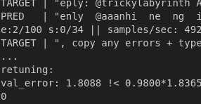</img>

### What finally worked

The model still couldn't get words right. The difference between my dataset and the shakespeare one was vocab size.

shakespeare.txt had a vocab size of 65. my posts had a char level vocab of 155!

So I stripped the dataset of all chars that infrequently occurred. I got my dataset down to a vocab size of 96.

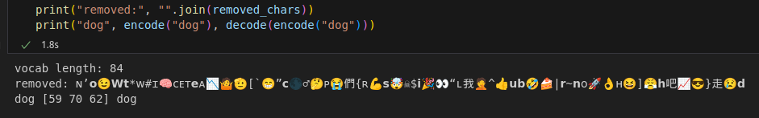</img>

Each token is put through an embedding table, so I wasn't sure whether reducing vocab would make an impact.

The model didn't seem to have less val loss, but, on inference, it learned words!!! Finally, the biggest hurdle has been overcome.

I spent WEEKS on this project. WEEKS. and the whole time, it was a vocab issue. LMAO

Also, lowering the temperature from 1.0 to 0.4 made word-level generation much more coherent.

## DANN posts/replies at varying temps

Here are some examples of outputs from the model.

note: I manually prompt it with "post: " or "reply: "

temp = 1

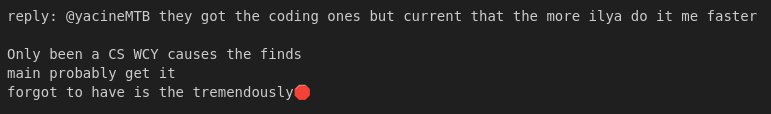</img>

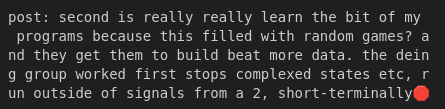</img>

temp = 0.5

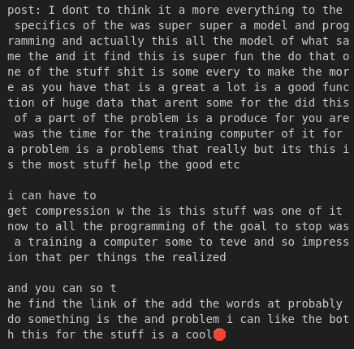</img>

temp = 0.25

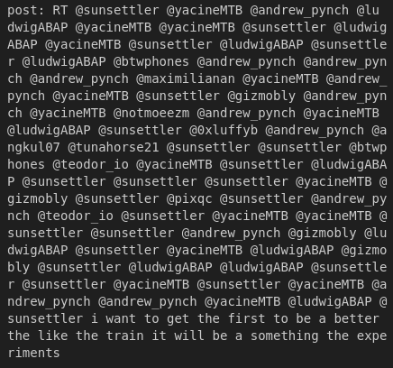</img>

temp = 1.5

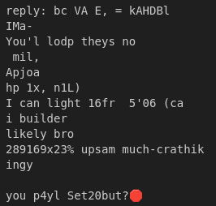</img>

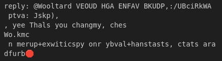</img>

temp = 2.0

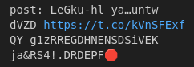</img>

temp = 0.4 (the best one)

See above. The ones at the top of this post are all temp=0.4, because that is the temperature at which the model most coherently output words while still being interesting/not going into loops.

BTW, if your language model goes in loops on inference, your temperature may be too low, or you may be argmaxing the output logits instead of doing a weighted random choice of the probabilities from the softmax.

The temperature calculation is done by dividing the logits by the temperature, and then softmaxing. I like to do `probs = softmax(logits / (temp + 0.001))` to prevent inf or zerodiv or whatever

## Lessons learned

It's good to struggle through this. I feel myself getting faster at implementing models. I had to rewrite the LSTM a few times and my speed of implementing changes is much faster. Not due to memorizing. I am noticably faster at implementing new training ideas, such as hyperparameter retuning or the ladder thing I mentioned previously.

I hope to get even faster the more I struggle with other experiments.

This one was fun. if it was some boring experiment, I might have walked away. But the lure of a cool result kept me hooked for weeks. The lesson is, do interesting things

In the future I shouldn't get stuck on one experiment. This one took me like a month. The initial implementation took like no time at all but optimizing it to output words coherently took a long, long time. While I'm learning, maybe I need to move on early if I'm making slow progress. This gives me a higher density of new information learned per day.

Maybe. Because I stuck with it and optimized the model, I figured out optimization methods that I'll probably use in future models. For example vocab reduction, or incorporating and then lowering temperature by a bit.

I'm conflicted on this point.

The main strategy though, I think, is to have fun while improving. So whatever maximizes some combination of fun and improvement.

## Resources I used
Some of these are also linked throughout the article

http://karpathy.github.io/2015/05/21/rnn-effectiveness/

~~https://colah.github.io/posts/2015-08-Understanding-LSTMs/~~

  https://d2l.ai/chapter_recurrent-modern/lstm.html use this one instead

https://github.com/karpathy/char-rnn/blob/master/train.lua (karpathy's code)

https://stackoverflow.com/a/58269606 (batch vs mini-batch vs n=1)

https://stackoverflow.com/a/53046624 (what LR should you use in a minibatch?) (scale = sqrt(n), or n)

https://stackoverflow.com/a/66546571 (super interesting 'what is the optimal mini batch LR' rabbit hole)

# Tips

Visualizing what is happening in your network seems to be one of the most important parts of ML. Both in your mind and also in the debugger or print() statements

Print your grad norms so you can see where the network is learning and where it isn't!

In jax, it's very easy to map a function over nested structures using `tree_util.tree_map`:

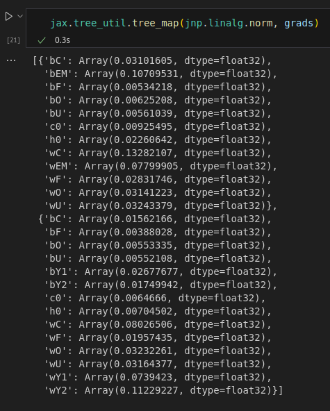</img>

using a lower temperature than 1.0 may help your language model form words coherently