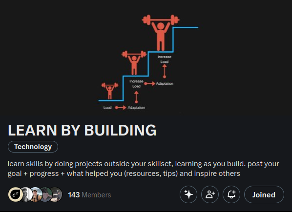
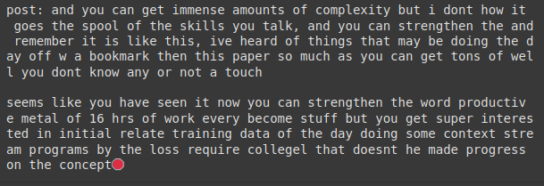
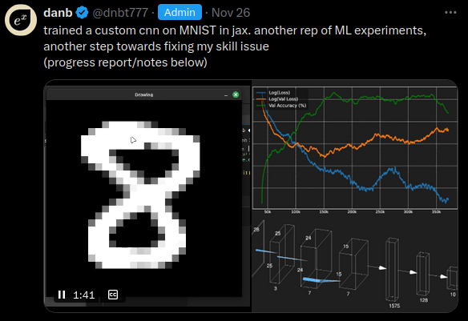

# LEARN BY BUILDING: ML Experiments from scratch in Jax

this is my series on doing ML experiments in jax (forward pass from scratch, automated backwards pass) to get faster/better at ML

in this repo I train my skills in ML by practicing implementing experiments in jax, and optimizing them

jax is basically numpy but it can do autograd. this way I can focus on implementing networks without having to implement backprop by hand

I am doing this in a community on X called ["LEARN BY BUILDING"](https://x.com/i/communities/1860178670687818191) where we build projects as a way to learn tech stuff: programming, robotics, etc. If you have something you want to learn, join, come up with a project, and post whenever you make progress!

# Projects in progress

Use GRPO to survive a 3-body physics simulation with rockets (status: [env implemented](https://x.com/dnbt777/status/1880936088648458420), GRPO implemented, needs debugging)

Double deep Q net that plays 6D snake (status: 2D version implemented, needs opengl renderer)

# projects so far

[Train a small (19.2M) transformer on the dictionary](https://x.com/dnbt777/status/1880140034239807640)

[Train an RNN/LSTM on my x posts](FINISHED/LSTM/LSTM.md)

[Train a CNN on MNIST](https://x.com/dnbt777/status/1861678239602913395)
  - custom CNN with skip connections on MNIST

Train an MLP on MNIST
